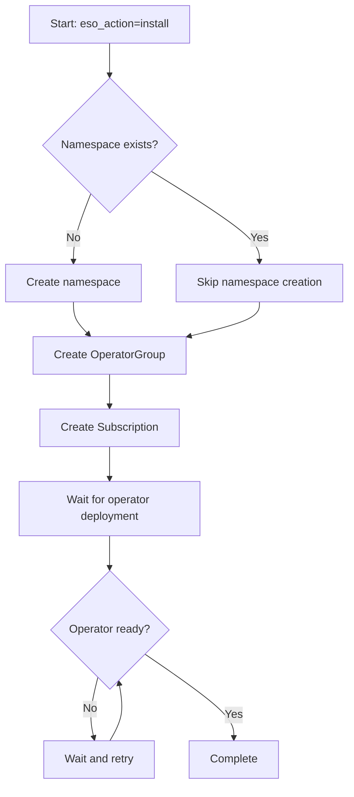
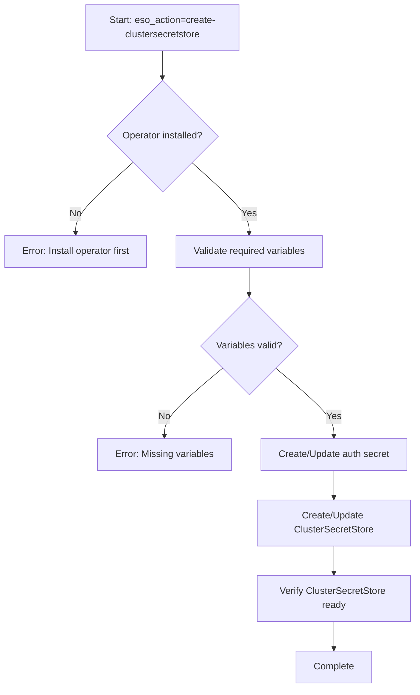
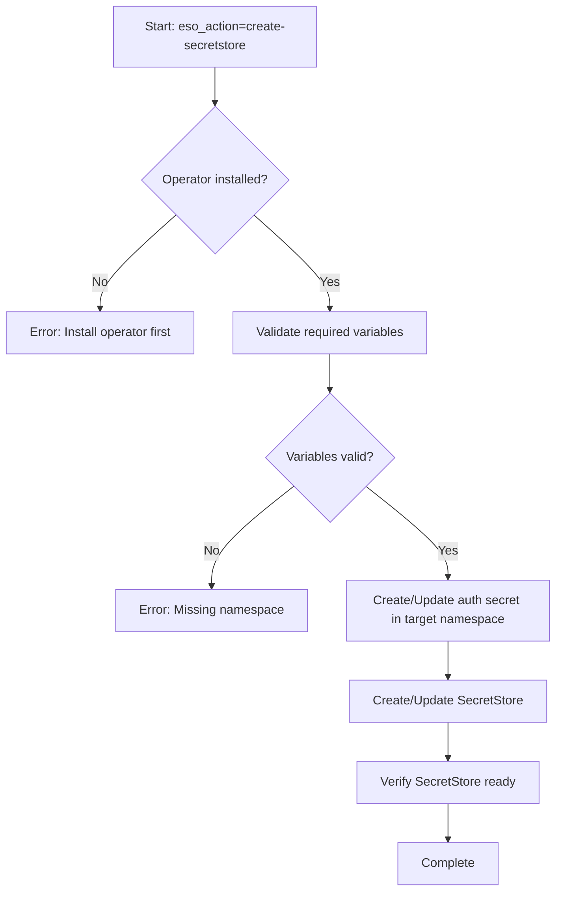
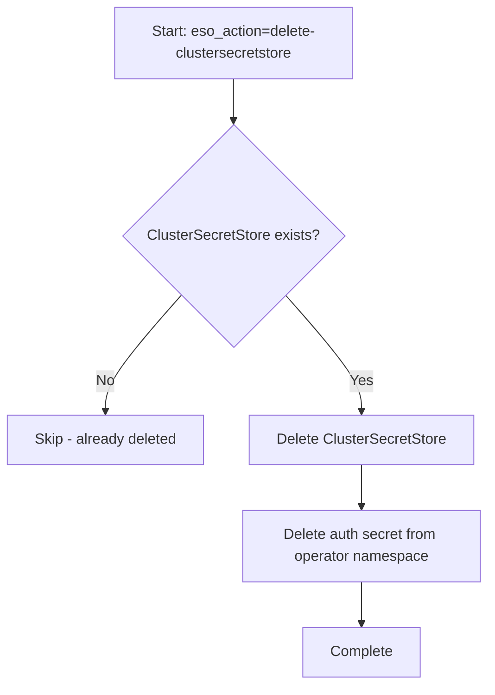
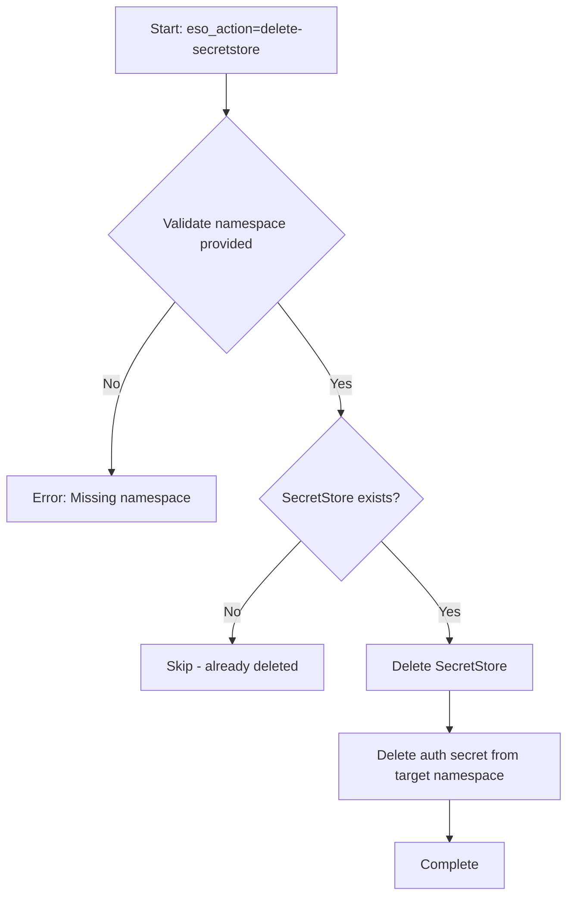

# External Secrets Operator (ESO) Role - Implementation Plan

## Overview
Create a new Ansible role `external_secrets` to install External Secrets Operator and configure it to connect to IBM Secrets Manager instances. This role will follow the established patterns in the ansible-devops collection.

## External Secrets Operator Architecture

### Core Components

1. **External Secrets Operator**
   - Kubernetes operator that synchronizes secrets from external systems
   - Watches ExternalSecret custom resources
   - Creates/updates Kubernetes secrets based on external secret data

2. **ClusterSecretStore** (Cluster-scoped)
   - Defines connection configuration to external secret backend
   - Can be referenced by ExternalSecrets in any namespace
   - Best practice for multi-namespace deployments
   - Stores reference to authentication credentials

3. **SecretStore** (Namespace-scoped)
   - Similar to ClusterSecretStore but limited to single namespace
   - Useful for namespace-specific backends or credentials

4. **ExternalSecret**
   - Defines which secrets to sync from external system
   - References a SecretStore or ClusterSecretStore
   - Specifies target Kubernetes secret name and keys
   - Can transform/template secret data

### IBM Secrets Manager Integration

**Authentication Methods:**
- IAM API Key (recommended for simplicity)
- IAM Trusted Profile (for workload identity)
- Service ID credentials

**Required Information:**
- IBM Secrets Manager instance URL/endpoint
- IAM API key or service credentials
- Region (if applicable)

**Secret Types Supported:**
- Arbitrary secrets (key-value pairs)
- Username/password credentials
- Certificates
- IAM credentials

## Role Design

### Role Name
`external_secrets` (following collection naming conventions)

### Directory Structure
```
ibm/mas_devops/roles/external_secrets/
├── README.md                          # Comprehensive documentation
├── defaults/
│   └── main.yml                       # Default variables
├── meta/
│   └── main.yml                       # Role metadata and dependencies
├── tasks/
│   ├── main.yml                       # Main task dispatcher (routes based on eso_action)
│   ├── install.yml                    # Install ESO operator
│   ├── uninstall.yml                  # Uninstall ESO operator
│   ├── create-secretstore.yml         # Create namespace-scoped SecretStore
│   ├── create-clustersecretstore.yml  # Create cluster-scoped ClusterSecretStore
│   ├── delete-secretstore.yml         # Delete namespace-scoped SecretStore
│   └── delete-clustersecretstore.yml  # Delete cluster-scoped ClusterSecretStore
├── templates/
│   ├── namespace.yml.j2               # Namespace template
│   ├── operator-group.yml.j2          # OperatorGroup template
│   ├── subscription.yml.j2            # Subscription template
│   ├── secret-store.yml.j2            # SecretStore template
│   ├── cluster-secret-store.yml.j2    # ClusterSecretStore template
│   └── examples/
│       ├── external-secret-arbitrary.yml.j2    # Example: arbitrary secret
│       ├── external-secret-credentials.yml.j2  # Example: username/password
│       └── external-secret-certificate.yml.j2  # Example: certificate
└── vars/
    └── main.yml                       # Internal variables (if needed)
```

## Role Variables

### General Variables

#### eso_action
- **Type:** String
- **Required:** No
- **Default:** `install`
- **Environment Variable:** `ESO_ACTION`
- **Valid Values:** `install`, `uninstall`, `create-secretstore`, `create-clustersecretstore`, `delete-secretstore`, `delete-clustersecretstore`, `none`
- **Description:** Specifies the action to perform on External Secrets Operator
  - `install`: Install the ESO operator
  - `uninstall`: Remove the ESO operator
  - `create-secretstore`: Create a namespace-scoped SecretStore for IBM Secrets Manager
  - `create-clustersecretstore`: Create a cluster-scoped ClusterSecretStore for IBM Secrets Manager
  - `delete-secretstore`: Delete a namespace-scoped SecretStore and its authentication secret
  - `delete-clustersecretstore`: Delete a cluster-scoped ClusterSecretStore and its authentication secret
  - `none`: Skip all actions

#### eso_namespace
- **Type:** String
- **Required:** No
- **Default:** `external-secrets-system`
- **Environment Variable:** `ESO_NAMESPACE`
- **Description:** Namespace where ESO operator will be installed

#### eso_operator_name
- **Type:** String
- **Required:** No
- **Default:** `external-secrets-operator`
- **Environment Variable:** `ESO_OPERATOR_NAME`
- **Description:** Name of the ESO operator subscription

### Installation Variables

#### eso_catalog_source
- **Type:** String
- **Required:** No
- **Default:** `community-operators`
- **Environment Variable:** `ESO_CATALOG_SOURCE`
- **Description:** Catalog source containing ESO operator
- **Note:** ESO is available in community-operators catalog

#### eso_channel
- **Type:** String
- **Required:** No
- **Default:** `stable`
- **Environment Variable:** `ESO_CHANNEL`
- **Description:** Subscription channel for ESO operator

#### eso_install_plan_approval
- **Type:** String
- **Required:** No
- **Default:** `Automatic`
- **Environment Variable:** `ESO_INSTALL_PLAN_APPROVAL`
- **Valid Values:** `Automatic`, `Manual`
- **Description:** Install plan approval strategy

### IBM Secrets Manager Configuration Variables

These variables are used when `eso_action` is `create-secretstore` or `create-clustersecretstore`.

#### ibm_sm_instance_url
- **Type:** String
- **Required:** Yes (when ibm_sm_enabled=true)
- **Environment Variable:** `IBM_SM_INSTANCE_URL`
- **Description:** IBM Secrets Manager instance URL (e.g., `https://{instance-id}.{region}.secrets-manager.appdomain.cloud`)

#### ibm_sm_api_key
- **Type:** String
- **Required:** Yes (when creating SecretStore or ClusterSecretStore)
- **Environment Variable:** `IBM_SM_API_KEY`
- **Default:** Falls back to `IBMCLOUD_APIKEY` if not set
- **Description:** IAM API key for authenticating to IBM Secrets Manager. If not provided, will use the value from `IBMCLOUD_APIKEY` environment variable.
- **Security:** Sensitive - should be passed securely
- **Note:** This follows the collection pattern of reusing IBM Cloud credentials when specific service credentials are not provided

#### ibm_sm_store_namespace
- **Type:** String
- **Required:** Yes (for create-secretstore action only)
- **Environment Variable:** `IBM_SM_STORE_NAMESPACE`
- **Description:** Target namespace where the SecretStore will be created (only used for `create-secretstore` action)

**Internal Implementation Details (not user-configurable):**
- SecretStore/ClusterSecretStore name: Always `ibm-secrets-manager`
- Authentication secret name: Always `ibm-sm-credentials`
- Authentication secret namespace:
  - For ClusterSecretStore: Always in ESO operator namespace (`external-secrets-system`)
  - For SecretStore: Always in the same namespace as the SecretStore (`ibm_sm_store_namespace`)


## Variable Defaults Implementation

The `defaults/main.yml` file will implement the API key fallback pattern:

```yaml
---
# General variables
eso_action: "{{ lookup('env', 'ESO_ACTION') | default('install', true) }}"
eso_namespace: "{{ lookup('env', 'ESO_NAMESPACE') | default('external-secrets-system', true) }}"
eso_operator_name: "{{ lookup('env', 'ESO_OPERATOR_NAME') | default('external-secrets-operator', true) }}"

# Installation variables
eso_catalog_source: "{{ lookup('env', 'ESO_CATALOG_SOURCE') | default('community-operators', true) }}"
eso_channel: "{{ lookup('env', 'ESO_CHANNEL') | default('stable', true) }}"
eso_install_plan_approval: "{{ lookup('env', 'ESO_INSTALL_PLAN_APPROVAL') | default('Automatic', true) }}"

# IBM Secrets Manager configuration
ibm_sm_instance_url: "{{ lookup('env', 'IBM_SM_INSTANCE_URL') }}"
ibm_sm_store_namespace: "{{ lookup('env', 'IBM_SM_STORE_NAMESPACE') }}"

# API key with fallback to IBMCLOUD_APIKEY (following collection pattern)
ibmcloud_apikey: "{{ lookup('env', 'IBMCLOUD_APIKEY') }}"
ibm_sm_api_key: "{{ lookup('env', 'IBM_SM_API_KEY') | default(ibmcloud_apikey, true) }}"
```

This pattern matches how other roles in the collection (like `mongodb` with AWS provider) handle credential fallback.

## Implementation Details

### Installation Flow (eso_action=install)



### Create ClusterSecretStore Flow (eso_action=create-clustersecretstore)



### Create SecretStore Flow (eso_action=create-secretstore)



### Delete ClusterSecretStore Flow (eso_action=delete-clustersecretstore)



### Delete SecretStore Flow (eso_action=delete-secretstore)



### Key Implementation Tasks

#### 1. Install Action (install.yml)
- Create namespace with appropriate labels
- Create OperatorGroup for all-namespaces watch
- Create Subscription to ESO operator
- Wait for operator deployment to be ready (timeout: 10 minutes)
- Verify CRDs are installed (SecretStore, ClusterSecretStore, ExternalSecret)

#### 2. Create ClusterSecretStore Action (create-clustersecretstore.yml)
- Validate operator is installed
- Validate required variables (instance URL, API key)
- Create Kubernetes secret with IBM SM credentials in specified namespace
- Create ClusterSecretStore resource with IBM SM provider configuration
- Verify ClusterSecretStore status is "Ready"

#### 3. Create SecretStore Action (create-secretstore.yml)
- Validate operator is installed
- Validate required variables (instance URL, API key, target namespace)
- Create Kubernetes secret with IBM SM credentials in target namespace
- Create SecretStore resource with IBM SM provider configuration
- Verify SecretStore status is "Ready"

#### 4. Delete ClusterSecretStore Action (delete-clustersecretstore.yml)
- Delete ClusterSecretStore resource `ibm-secrets-manager`
- Delete authentication secret `ibm-sm-credentials` from operator namespace
- Verify resources are removed

#### 5. Delete SecretStore Action (delete-secretstore.yml)
- Validate required variable (target namespace)
- Delete SecretStore resource `ibm-secrets-manager` from target namespace
- Delete authentication secret `ibm-sm-credentials` from target namespace
- Verify resources are removed

#### 6. Uninstall Action (uninstall.yml)
- Remove Subscription
- Remove OperatorGroup
- Remove namespace (optional, controlled by variable)
- Note: Does not remove SecretStores/ClusterSecretStores (use delete actions first)

#### 7. Validation and Wait Conditions
- Wait for ESO operator deployment: `external-secrets` and `external-secrets-webhook`
- Wait for CRDs to be established
- Wait for SecretStore/ClusterSecretStore to report "Ready" status
- Implement retry logic with exponential backoff

## Templates

### ClusterSecretStore Template (IBM Secrets Manager)

```yaml
apiVersion: external-secrets.io/v1beta1
kind: ClusterSecretStore
metadata:
  name: ibm-secrets-manager
spec:
  provider:
    ibm:
      serviceUrl: {{ ibm_sm_instance_url }}
      auth:
        secretRef:
          secretApiKey:
            name: ibm-sm-credentials
            namespace: {{ eso_namespace }}
            key: apiKey
```

### SecretStore Template (IBM Secrets Manager)

```yaml
apiVersion: external-secrets.io/v1beta1
kind: SecretStore
metadata:
  name: ibm-secrets-manager
  namespace: {{ ibm_sm_store_namespace }}
spec:
  provider:
    ibm:
      serviceUrl: {{ ibm_sm_instance_url }}
      auth:
        secretRef:
          secretApiKey:
            name: ibm-sm-credentials
            namespace: {{ ibm_sm_store_namespace }}
            key: apiKey
```

### Example ExternalSecret (Arbitrary Secret)

```yaml
apiVersion: external-secrets.io/v1beta1
kind: ExternalSecret
metadata:
  name: example-secret
  namespace: my-namespace
spec:
  refreshInterval: 1h
  secretStoreRef:
    name: ibm-secrets-manager
    kind: ClusterSecretStore
  target:
    name: my-kubernetes-secret
    creationPolicy: Owner  # See creationPolicy options below
  data:
    - secretKey: username
      remoteRef:
        key: my-secret-id
        property: username
    - secretKey: password
      remoteRef:
        key: my-secret-id
        property: password
```

### ExternalSecret Creation Policies

The `creationPolicy` field controls how ESO manages the target Kubernetes secret:

#### `Owner` (Recommended - Default)
- **Behavior**: ESO creates and owns the secret. If the ExternalSecret is deleted, the secret is also deleted.
- **Use case**: Standard use case where ESO fully manages the secret lifecycle
- **Ownership**: ExternalSecret has an owner reference to the secret
- **Example**:
  ```yaml
  target:
    name: my-secret
    creationPolicy: Owner
  ```

#### `Orphan`
- **Behavior**: ESO creates the secret but doesn't set an owner reference. If the ExternalSecret is deleted, the secret remains.
- **Use case**: When you want the secret to persist even after removing the ExternalSecret
- **Ownership**: No owner reference - secret is independent
- **Example**:
  ```yaml
  target:
    name: my-secret
    creationPolicy: Orphan
  ```

#### `Merge`
- **Behavior**: ESO merges data into an existing secret without overwriting other keys. Creates the secret if it doesn't exist.
- **Use case**: When multiple ExternalSecrets need to populate different keys in the same secret
- **Ownership**: No owner reference - allows multiple ExternalSecrets to contribute
- **Example**:
  ```yaml
  target:
    name: shared-secret
    creationPolicy: Merge
  ```

#### `None`
- **Behavior**: ESO updates an existing secret but will NOT create it if it doesn't exist. Fails if secret is missing.
- **Use case**: When the secret must be pre-created (e.g., by another process) and ESO should only update it
- **Ownership**: No owner reference - assumes external management
- **Example**:
  ```yaml
  target:
    name: pre-existing-secret
    creationPolicy: None
  ```

**Recommendation**: Use `Owner` (default) for most cases as it provides clean lifecycle management. Use `Merge` when multiple ExternalSecrets need to populate the same secret with different keys.

## Documentation Requirements

### README.md Structure
Following the collection's standard format:

1. **Overview**
   - Brief description of ESO and its purpose
   - IBM Secrets Manager integration capabilities

2. **Prerequisites**
   - OpenShift cluster with admin access
   - IBM Secrets Manager instance
   - IAM API key with appropriate permissions

3. **Role Variables**
   - Comprehensive documentation for each variable
   - Include: description, type, required/optional, default, environment variable, valid values, impact

4. **Usage Examples**
   - Install ESO operator only
   - Create ClusterSecretStore for IBM Secrets Manager
   - Create namespace-scoped SecretStore
   - Complete setup (install + create-clustersecretstore)
   - Uninstall ESO

5. **IBM Secrets Manager Setup**
   - How to create an IBM SM instance
   - How to generate IAM API key
   - Required IAM permissions
   - How to create secrets in IBM SM

6. **Creating ExternalSecrets**
   - Examples for different secret types
   - Best practices for secret synchronization
   - Troubleshooting common issues


## Testing Strategy

### Unit Testing
- Variable validation
- Template rendering
- Conditional logic

### Integration Testing
1. **Installation Test**
   - Run with `eso_action=install`
   - Verify operator is running
   - Verify CRDs are created

2. **ClusterSecretStore Test**
   - Run with `eso_action=create-clustersecretstore`
   - Verify ClusterSecretStore is ready
   - Create test ExternalSecret in any namespace
   - Verify Kubernetes secret is created and synced

3. **SecretStore Test**
   - Run with `eso_action=create-secretstore`
   - Verify SecretStore is ready in target namespace
   - Create test ExternalSecret in same namespace
   - Verify Kubernetes secret is created and synced

4. **Uninstall Test**
   - Run with `eso_action=uninstall`
   - Verify operator is removed
   - Verify namespace cleanup

5. **Delete Test**
   - Create ClusterSecretStore
   - Run with `eso_action=delete-clustersecretstore`
   - Verify ClusterSecretStore and auth secret are removed
   - Create SecretStore in test namespace
   - Run with `eso_action=delete-secretstore`
   - Verify SecretStore and auth secret are removed

6. **End-to-End Test**
   - Install ESO (`eso_action=install`)
   - Create ClusterSecretStore (`eso_action=create-clustersecretstore`)
   - Create multiple ExternalSecrets in different namespaces
   - Verify secret synchronization
   - Test secret rotation
   - Delete ClusterSecretStore (`eso_action=delete-clustersecretstore`)
   - Uninstall ESO (`eso_action=uninstall`)

## Collection Integration

### Files to Update

1. **mkdocs.yml**
   - Add role documentation link

2. **build/bin/copy-role-docs.sh**
   - Add role to documentation build

3. **docs/changes.md**
   - Add changelog entry for new role

4. **ibm/mas_devops/README.md**
   - Add role to collection README

### Example Playbooks

#### Example 1: Install ESO Operator Only

```yaml
---
# Install ESO operator
- hosts: localhost
  any_errors_fatal: true
  vars:
    eso_action: install
    eso_namespace: external-secrets-system
  roles:
    - ibm.mas_devops.external_secrets
```

#### Example 2: Create ClusterSecretStore

```yaml
---
# Create ClusterSecretStore for IBM Secrets Manager
# Only requires instance URL and API key - all other values use sensible defaults
- hosts: localhost
  any_errors_fatal: true
  vars:
    eso_action: create-clustersecretstore
    ibm_sm_instance_url: "{{ lookup('env', 'IBM_SM_INSTANCE_URL') }}"
    # ibm_sm_api_key will fall back to IBMCLOUD_APIKEY if not set
  roles:
    - ibm.mas_devops.external_secrets
```

#### Example 3: Create Namespace-Scoped SecretStore

```yaml
---
# Create SecretStore in specific namespace
# Only requires instance URL, API key, and target namespace
- hosts: localhost
  any_errors_fatal: true
  vars:
    eso_action: create-secretstore
    ibm_sm_instance_url: "{{ lookup('env', 'IBM_SM_INSTANCE_URL') }}"
    ibm_sm_store_namespace: my-app-namespace
    # ibm_sm_api_key will fall back to IBMCLOUD_APIKEY if not set
  roles:
    - ibm.mas_devops.external_secrets
```

#### Example 4: Complete Setup (Install + Configure)

```yaml
---
# Complete ESO setup with ClusterSecretStore
- hosts: localhost
  any_errors_fatal: true
  tasks:
    # Step 1: Install ESO operator
    - name: Install External Secrets Operator
      include_role:
        name: ibm.mas_devops.external_secrets
      vars:
        eso_action: install
        eso_namespace: external-secrets-system

    # Step 2: Create ClusterSecretStore
    - name: Create ClusterSecretStore for IBM Secrets Manager
      include_role:
        name: ibm.mas_devops.external_secrets
      vars:
        eso_action: create-clustersecretstore
        ibm_sm_instance_url: "{{ lookup('env', 'IBM_SM_INSTANCE_URL') }}"
        # All other values use sensible defaults
```

## Security Considerations

1. **Credential Management**
   - API keys should never be logged
   - Use `no_log: true` for sensitive tasks
   - Credentials stored in Kubernetes secrets with appropriate RBAC

2. **RBAC**
   - ESO operator requires cluster-wide permissions
   - ClusterSecretStore can be referenced from any namespace
   - Consider namespace-scoped SecretStores for sensitive environments

3. **Secret Rotation**
   - Document how to rotate IBM SM API keys
   - ExternalSecrets automatically sync on refresh interval
   - Consider implementing secret rotation automation

4. **Audit Logging**
   - Log all configuration changes
   - Track ClusterSecretStore creation/updates
   - Monitor ExternalSecret sync failures

## Best Practices

1. **Multi-Namespace Usage**
   - Use ClusterSecretStore for shared backends
   - Create ExternalSecrets in each namespace that needs secrets
   - Centralize authentication credentials in operator namespace

2. **Secret Organization**
   - Use consistent naming conventions for ExternalSecrets
   - Group related secrets in IBM SM
   - Use labels for organization and filtering

3. **Monitoring**
   - Monitor ExternalSecret sync status
   - Alert on sync failures
   - Track secret refresh intervals

4. **Disaster Recovery**
   - Regular backups of ESO configuration
   - Document IBM SM instance details
   - Test restore procedures

## Future Enhancements

1. **Additional Actions**
   - `list-stores`: List all SecretStores and ClusterSecretStores
   - `validate-store`: Validate a SecretStore/ClusterSecretStore connection

2. **Multiple Secret Backends**
   - Support for additional providers (AWS, Azure, HashiCorp Vault)
   - Multiple ClusterSecretStore configurations

3. **MAS Integration**
   - Generate MAS-specific ExternalSecret templates
   - Integration with MAS configuration workflow

4. **Advanced Features**
   - Secret templating and transformation
   - Push secrets (write back to external system)
   - Secret generators

5. **Monitoring Integration**
   - Grafana dashboards for ESO metrics
   - Prometheus alerts for sync failures

## Success Criteria

- [ ] Role successfully installs ESO operator (`eso_action=install`)
- [ ] Role creates ClusterSecretStore for IBM SM (`eso_action=create-clustersecretstore`)
- [ ] Role creates namespace-scoped SecretStore (`eso_action=create-secretstore`)
- [ ] Role deletes ClusterSecretStore (`eso_action=delete-clustersecretstore`)
- [ ] Role deletes namespace-scoped SecretStore (`eso_action=delete-secretstore`)
- [ ] Role successfully uninstalls ESO (`eso_action=uninstall`)
- [ ] ExternalSecrets can sync secrets from IBM SM using created stores
- [ ] Documentation is comprehensive and follows collection standards
- [ ] Role passes ansible-lint validation
- [ ] End-to-end testing validates all actions
- [ ] Integration with MAS CLI (if applicable)

## Timeline Estimate

- Research and design: 1-2 days
- Implementation: 3-4 days
- Testing: 2-3 days
- Documentation: 1-2 days
- Review and refinement: 1-2 days

**Total: 8-13 days**

## References

- [External Secrets Operator Documentation](https://external-secrets.io/)
- [IBM Secrets Manager Documentation](https://cloud.ibm.com/docs/secrets-manager)
- [ESO IBM Provider Documentation](https://external-secrets.io/latest/provider/ibm-secrets-manager/)
- [Ansible DevOps Collection Standards](CONTRIBUTING.md)