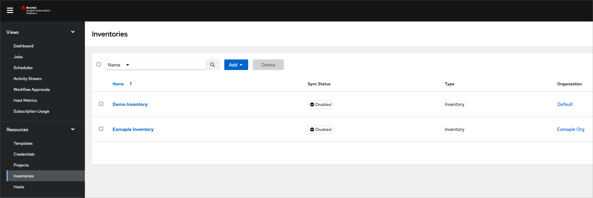

Execution Environment
===============================================================================
Details on the [Red Hat Ansible Automation Platform](https://www.redhat.com/en/technologies/management/ansible) Execution Environment for the **ibm.mas_devops** Ansible Collection.


Execution Environment Image
-------------------------------------------------------------------------------
The execution environment image for ansible-devops builds on the latest ansible-automation-platform-24/ee-supported-rhel9 image from Red Hat that provides the ansible-core and Red Hat supported collections. The ansible-devops-ee image includes the `ibm.mas_devops` collection and all required client libraries to function.

The image is uploaded to quay.io at [quay.io/ibmmas/ansible-devops-ee](https://quay.io/ibmmas/ansible-devops-ee)


How to setup Anisble Automation Platform
-------------------------------------------------------------------------------

### Organization
An Organization is a logical collection of Users, Teams, Projects, and Inventories, and is the highest level in the automation controller object hierarchy. Create an organization if you don't already have one:


### Inventory
An Inventory is a collection of hosts against which jobs may be launched, the same as an Ansible inventory file. The `ibm.mas_devops` collection runs against localhost so an Inventory of hosts just requires the one host of `localhost` to be added but this might be important for any other roles you might want to execute outside of this collection but within this organization. Create an initial inventory if one doesn't exist yet:



Ensure that the host entry has the following variables set to ensure a local connection:


### Execution Environment
In Ansible Automation Platform (AAP) you can setup a new Execution Environment by specifying the image and tag. You can use either a versioned tag or latest such as `quay.io/ibmmas/ansible-devops-ee:latest` or `quay.io/ibmmas/ansible-devops-ee:24.0.0`


### Credentials
To use your own playbooks that are in source control management (SCM) you will need to setup credentials in AAP to fetch these (unless the repo is public). An example of this is providing a GitHub fine-grained access token which will just allow the token to read the contents of the repo.


¡[creds-2](images/credentials-2.png)

Depending on if you have an exiting cluster or not, then you will need to setup the `OpenShift or Kubernetes API Bearer Token` credentials to access the Openshift cluster, which will be required on any Jobs that interect with the cluster.


### Project
Once you have the execution environment setup you can now create a Project that will point to the source of your playbooks. It is recommended that you use your own source of playbooks rather than the playbooks contained in this repo, to give you full control over what is run to suit your needs. Create the Project and set the Execution Environment to be the one created eariler, and set the source control details and credentials needed for AAP to read your playbooks.


### Job Templates
The Job Templates are what each Job is launched from and contains the details of what Playbook to execute. The Job is the executed instance of a Template that contains any specific values required.

To create the Template add the Inventory, Project and Execution Environment setup previously. The playbook dropdown should contain all the playbooks that are found in your SCM (if no playbooks are shown then check the [Troubleshooting](#troubleshooting) section). At this point you can choose any other settings that you might want to use, and it is recommended to check the AAP [documentation](https://docs.redhat.com/en/documentation/red_hat_ansible_automation_platform/2.5) on this.


Once the Job template is created then you can click on the created template and navigate to `Survey`. This is where you can provide any secure variables for your playbook that you don't want to keep in source control. You can choose the questions to ask and what type the variable should be. The variable name should make the variable name that the corresponding role is expecting.


Finally, ensure that the Survey is Enabled:


### Workflow Templates
The Workflow Templates allow you to configure a number of job templates (or other workflow templates) together. This can be useful when you want to use other roles from other collections (see the AAP Certified Content [here](https://access.redhat.com/support/articles/ansible-automation-platform-certified-content)) as well as the ansible-devops collection. For example, you might want to run some AWS or VMWare roles to configure resources after or before the ansible-devops collection roles.


How to run a Job
-------------------------------------------------------------------------------
Now you have the Job Template setup, you can launch the Job from that Template. Navigate to the Templates view and click the launch icon:


Enter any survey questions you have configured:


The Job now launches and you can see the output. The list of executing and executed jobs can be seen from the Jobs seciton


Examples of playbooks
-------------------------------------------------------------------------------
You can use the ansbile-devops [playbooks](https://github.com/ibm-mas/ansible-devops/tree/master/ibm/mas_devops/playbooks) as a reference on how to setup your own playbooks. Defining your own playbooks gives you full control over what roles can be run and also include your own roles or roles from the supported Red Hat collection.

If you are using the [playbooks](https://github.com/ibm-mas/ansible-devops/tree/master/ibm/mas_devops/playbooks) as a starting point then please note the following changes that would be required:

- Remove any pre_tasks related to environment variables
- Remove any lookups of environment variables from the playbook

### oneclick_core.yml
An example of this is taking the `oneclick_core.yml` playbook:

```yaml
---
- hosts: localhost
  any_errors_fatal: true
  vars:
    # Install SLS
    # Note: We need to create some intermediate variables to construct sls_mongodb_cfg_file,
    # This is the only reason they feature here, all the roles that use these variables would also
    # load them directly from the same environment variables if they were not defined here.
    mas_config_dir: "{{ lookup('env', 'MAS_CONFIG_DIR') }}"
    mongodb_namespace: "{{ lookup('env', 'MONGODB_NAMESPACE') | default('mongoce', True) }}"
    sls_mongodb_cfg_file: "{{ mas_config_dir }}/mongo-{{ mongodb_namespace }}.yml"

    # Core Services Configuration
    mas_channel: "{{ lookup('env', 'MAS_CHANNEL') | default('9.0.x', true) }}"

    # Workspace Configuration
    mas_workspace_name: "{{ lookup('env', 'MAS_WORKSPACE_NAME') | default('MAS Development', true) }}"
    mas_workspace_id: "{{ lookup('env', 'MAS_WORKSPACE_ID') | default('masdev', true) }}"

  pre_tasks:
    # For the full set of supported environment variables refer to the playbook documentation
    - name: Check for required environment variables
      assert:
        that:
          # IBM
          - lookup('env', 'IBM_ENTITLEMENT_KEY') != ""
          # MAS
          - lookup('env', 'MAS_INSTANCE_ID') != ""
          - lookup('env', 'MAS_CONFIG_DIR') != ""
          # SLS
          - (lookup('env', 'SLS_LICENSE_ID') != "" and lookup('env', 'SLS_LICENSE_FILE') != "") or
            (lookup('env', 'SLS_ENTITLEMENT_FILE') != "")
          # DRO
          - lookup('env', 'DRO_CONTACT_EMAIL') != ""
          - lookup('env', 'DRO_CONTACT_FIRSTNAME') != ""
          - lookup('env', 'DRO_CONTACT_LASTNAME') != ""
        fail_msg: "One or more required environment variables are not defined"

  roles:
    # 1. Install cluster-scoped dependencies (e.g. Cert-Manager, Operator Catalogs) & Grafana
    - ibm.mas_devops.ibm_catalogs
    - ibm.mas_devops.cert_manager
    - ibm.mas_devops.grafana

    # 2. Install MongoDb
    - ibm.mas_devops.mongodb

    # 3. Install SLS
    # Set sls_url, sls_tls_crt_local_file_path, sls_registration_key variables to skip install and set up SLSCfg for
    # an existing installation of SLS
    - ibm.mas_devops.sls

    # 4 Install DRO
    - ibm.mas_devops.dro

    # 5. Generate a Workspace
    - ibm.mas_devops.gencfg_workspace

    # 6. Install & configure MAS
    - ibm.mas_devops.suite_dns
    - ibm.mas_devops.suite_certs
    - ibm.mas_devops.suite_install
    - ibm.mas_devops.suite_config
    - ibm.mas_devops.suite_verify
```

and changing it to look like the following:

```yaml
---
- name: "oneclick-core"
  hosts: localhost
  any_errors_fatal: true
  vars:
    mas_config_dir: "/tmp"
    mongodb_namespace: "mongoce"
    sls_mongodb_cfg_file: "{{ mas_config_dir }}/mongo-{{ mongodb_namespace }}.yml"

    # Core Services Configuration
    mas_channel: "9.0.x"

    mas_instance_id: "aap1"

    # Workspace Configuration
    mas_workspace_name: "MAS Development"
    mas_workspace_id: "masdev"

    entitlement_file: "license_file/entitlement.lic"

    dro_contact:
      email: "whitfiea@uk.ibm.com"
      first_name: "Andrew"
      last_name: "Whitfield"

  roles:
    # 1. Install cluster-scoped dependencies (e.g. Cert-Manager, Operator Catalogs) & Grafana
    - ibm.mas_devops.ibm_catalogs
    - ibm.mas_devops.cert_manager

    # 2. Install MongoDb
    - ibm.mas_devops.mongodb

    # 3. Install SLS
    - ibm.mas_devops.sls

    # 4 Install DRO
    - ibm.mas_devops.dro

    # 5. Generate a Workspace
    - ibm.mas_devops.gencfg_workspace

    # 6. Install & configure MAS
    - ibm.mas_devops.suite_install
    - ibm.mas_devops.suite_config
    - ibm.mas_devops.suite_verify
```

The above has removed any environment variable lookups in the playbook itself, and also modified the roles so it doesn't run the `grafana` role.

### ocp-provision
If you need to set an environment variable then you can do this in the playbook as well, this would be needed in certain cases such as setting the AWS cli details. The `aws_access_key_id` and `aws_secret_access_key` are variables set by AAP as a result of the Survey questions:

```yaml
---
- name: "ocp-provision"
  hosts: localhost
  vars:
    cluster_name: testcluster
    cluster_type: rosa
    ocp_version: 4.14.35
    rosa_compute_nodes: 3

  environment:
    AWS_DEFAULT_REGION: us-east-1
    AWS_ACCESS_KEY_ID: "{{ aws_access_key_id }}"
    AWS_SECRET_ACCESS_KEY: "{{ aws_secret_access_key }}"

  roles:
    # 1. Provision the ROSA cluster
    - ibm.mas_devops.ocp_provision

    # 2. Login and verify the cluster is ready
    - ibm.mas_devops.ocp_login
    - ibm.mas_devops.ocp_verify

    # 3. Set up storage classes
    - ibm.mas_devops.ocp_efs
```

Troubleshooting
-------------------------------------------------------------------------------

### Helpful Links
- [Red Hat AAP documentation](https://docs.redhat.com/en/documentation/red_hat_ansible_automation_platform/2.5)
- [Installing AAP in OCP](https://docs.redhat.com/en/documentation/red_hat_ansible_automation_platform/2.5/html/installing_on_openshift_container_platform/index)
- [Other install methods of AAP](https://docs.redhat.com/en/documentation/red_hat_ansible_automation_platform/2.5#Installing)
- [AAP Certified Content](https://access.redhat.com/support/articles/ansible-automation-platform-certified-content)

### Can't see all output in log file
The output for the job doesn't output all the data in the standard view. To see the expanded data you must click on the entry to see the details and then select JSON:


### My playbook or updated playbook can't be found
If you have updated your Playbook in your SCM but it is not reflected in AAP then you can sync the Project. Navigate to the Project view and click the `sync` icon so the Project gets the latest revision.


### Job failed can I re-launch it?
If the job fails and you want to relaunch with the same variables (from both hosts and survey), then you can re-launch the job from the Job page or the Jobs list page


### How to provide supporting files?
If you have a file that is not a playbook but you want to reference it, then you can include this in the same repo as your playbooks as AAP will be syncing the whole repo. You can then reference these files from your playbook or roles, using a pth relative to the playbook being run. An exmaple of this is the entitlement_file which can be contained in your repo:


and then referenced in your playbook in the path `"license_file/entitlement.lic"`:

```yaml
---
- hosts: localhost
  any_errors_fatal: true
  vars:
    mas_config_dir: "/tmp"
    mongodb_namespace: "mongoce"
    sls_mongodb_cfg_file: "{{ mas_config_dir }}/mongo-{{ mongodb_namespace }}.yml"
    entitlement_file: "license_file/entitlement.lic"
  roles:
    - ibm.mas_devops.mongodb
    - ibm.mas_devops.sls
```

### How do I set environment variables?
Running in AAP means you can't set environment variables on the ansible controller before a playbook is executed. If a role in the `ibm.mas_devops` collection has an environment variable to be set there is normally a corresponding ansible variable. For exmaple, in the documentation for (kafka_action)[https://ibm-mas.github.io/ansible-devops/roles/kafka/#kafka_action] in the `kafka` role it says to set the environment variable `KAFKA_VERSION`, this is just setting the ansible role varible called `kafka_version` which you can set in your playbook. With ansible predence in place, the play vars or role vars will override the default vars that use the environment variable.

Example setting play vars:
```yaml
---
- hosts: localhost
  any_errors_fatal: true
  vars:
    kafka_version: 3.7.0
  roles:
    - ibm.mas_devops.kafka
```

Example setting role vars:
```yaml
---
- hosts: localhost
  any_errors_fatal: true

  roles:
    - role: ibm.mas_devops.kafka
      vars:
        kafka_version: 3.7.0
```
